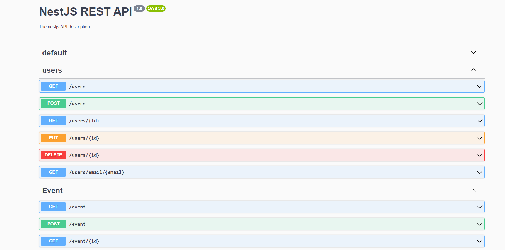

## Description

 This is a service developed with [Nest](https://github.com/nestjs/nest) Framework with the purpose of managing events, it consists of three modules (Events, Users and Auth) as a CRUD we can interact with the events module in turn with a user and authentication module to carry an event log per users


## Requirements

- [Node](https://nodejs.org/)
- [Npm](https://www.npmjs.com/) (preferably) or [yarn](https://yarnpkg.com/)
- [Docker](https://www.docker.com/)

## Installation

```bash
$ npm install
```

## Running the app

```bash
# development
$ npm run start

# Docker (recomended)
$ docker compose build
$ docker compose up
```

## Test

```bash
# unit test event
$ npx jest event.service.spec.ts
$ npx jest event.controller.spec.ts

# unit test users
$ npx jest users.service.spec.ts
$ npx jest users.controller.spec.ts

# test coverage
$ npm run test:cov
```

## Swagger
### `/docs`



